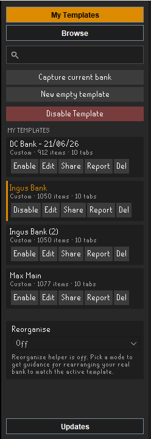
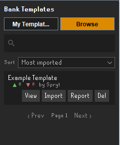
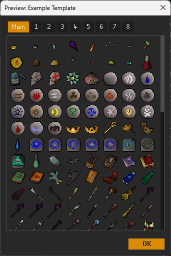
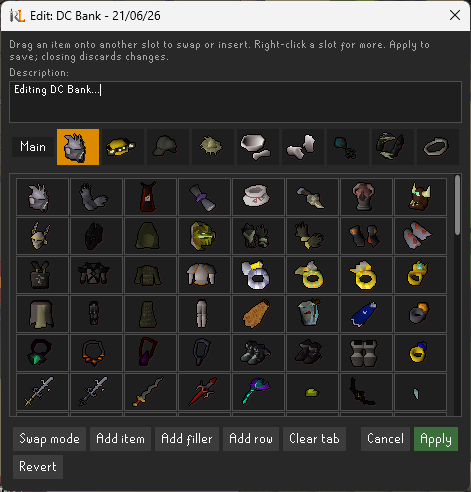
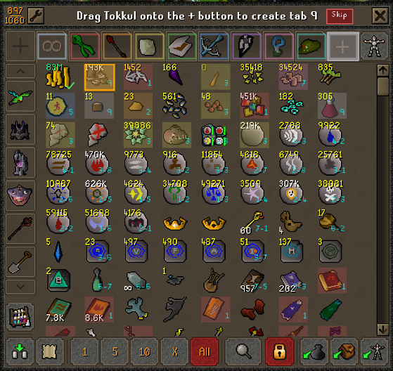

# 🏦 Bank Templates

**Save, apply, and share bank layouts. Your real bank is never touched.**

---

Bank Templates arranges your items into a chosen order, per tab, and renders that layout **virtually**
over the bank. Nothing is moved and nothing is ever sent to the game server, so it stays safely within
Jagex's third-party client rules. You can snapshot your current bank as a template, apply your own or
the community's, build layouts for items you don't even own yet, and get guided help reorganising your
*real* bank to match.

> **Free forever.** Every feature this plugin has now - and everything we keep adding to it - stays
> free, with no ads and nothing paywalled. [Exchange Insights](https://exchange-insights.gg) membership
> is a separate, optional thing for going further on the website (bank-value tracking and more);
> linking an account is opt-in and never changes the free plugin.

## ✨ Highlights

- 📸 **Capture your bank** into a reusable, shareable template in one click.
- 🧩 **Per-tab layouts** rendered virtually over the bank, with placeholders for items you don't own.
- ✏️ **Layout editor** to build or tweak a template without owning a single item.
- 🧭 **Reorganise helper** that guides you, move by move, to make your real bank match, with colour
  coding, on-item labels, or step-by-step prompts (mix and match).
- 🌍 **Community repository** to browse, preview, import, and share templates (opt-in).
- 🔢 **"x / y items" counts** on every card so you can see, at a glance, how much of a template you own.

---

## Features

### Templates and layouts

- **Per-tab templates** - a template stores a layout for the main view and each numbered bank tab, and
  applies whichever tab you're viewing. The all-items view shows your whole template grouped tab-by-tab,
  with thin dividers between tabs and before any items not in the template.
- **Capture your bank** - one click snapshots every tab, in order, into a new template.
- **Layout editor** - build or tweak a layout *without owning the items*: search for any item and drop
  it in as a faded placeholder, then drag to rearrange, swap or insert, and mark filler / empty slots.
- **Placeholders** - items a template wants but you don't own yet show as faded icons in place.
- **Filler slots (🚫)** - reserve slots for items you still need to acquire.
- **Bigger-than-your-bank templates** - extra slots are still drawn, and the bank's slot counter shows
  the template's size (turning red if it won't fit).
- **Template-defined width** - layouts render at the column count they were designed for (default 8),
  so they look the same regardless of your bank window size.

### Applying templates over your bank

- **Virtual, read-only** - the layout is drawn over the bank; your real items never move.
- **"x / y items" counts** - each card shows how many of a template's items you currently own out of the
  total (variant-aware). The count is cached per account, so it shows from your last visit even before
  you open the bank, then updates live as your bank changes.
- **Enable / Disable per template** - toggle a template on or off straight from its card; the
  **Disable Template** button at the top clears the active one and shows your normal bank.
- **Preview windows** - **View** opens an interactive mini-bank beside the client (so the game stays
  clickable), with tab buttons and item names on hover, sized consistently whatever the description.
- **Plays nicely with other plugins** - items are positioned by identity (each keeps its own bank slot),
  so plugins like Inventory Setups that highlight or withdraw by slot still target the right items. When
  a Bank Tags tag tab or a search is open, the plugin steps aside and lets that view render normally.

### Reorganise helper

Guided help to rearrange your *real* bank to match a template. **You** drag the items yourself; the
plugin only shows you what to do. Pick any combination of three display styles:

- 🎨 **Colour-coded** - tints each out-of-place item, and outlines every tab, with the destination tab's
  colour, so you can see where things belong at a glance. Each tab's colour is customisable in settings.
- 🏷️ **Labels** - tags each out-of-place item with its destination tab (the main tab shown as **∞**),
  then its row and column; items already in the right slot get a green tick.
- 👣 **Step-by-step** - walks you through one move at a time, with the instruction in the bank's title
  bar and the destination slot highlighted. It moves each item to its tab as you reach it (creating new
  tabs inline), then sorts each tab into place, choosing swap or insert to keep the number of drags down.
  Drag an item to the wrong slot and it sends that one item straight back to its correct spot in a single
  insert, rather than nudging its neighbours over one at a time. It also helps you set up: reserving slots
  for items you don't own yet with the game's **Bank Fillers** (telling you the exact number to enter,
  with a **Skip** option), and creating extra tabs by dragging onto the **+**.

Item kits and alternate versions of an item (charged/uncharged, degraded, recoloured, and so on) count
as the same item, so the helper won't flag a slot just because you hold a different variant.

### Community repository (optional, opt-in)

- **Browse and search** - search matches template names *and* RuneScape names. Sort by **Most imported**,
  **Newest**, **Popular (30 days)**, or **Items owned** (how much of each you already have). Browse cards
  also show the "x / y items" count.
- **Preview and import** - preview any template, then import a copy to *My templates*.
- **Share** - upload your template with an optional description (up to 500 characters), credited to your
  RuneScape name or shared **anonymously**.
- **Votes and reports** - each template shows imports vs reports; report flags one for moderation.

### Updates tab

The side panel shows the latest patch notes after each update, opening on them once until you've seen
that version's notes.

---

## 🛡️ How it stays within the rules

The plugin only **reads** your bank and **repositions item widgets client-side** for display, the same
technique RuneLite's built-in Bank Tag Layouts uses. It never moves items, injects input, or adds menu
entries that send actions to the server, all of which are forbidden by Jagex's third-party guidelines.
Reorganising your real bank is always done by you, manually.

---

## Using the plugin

Open the **Bank Templates** side panel from the RuneLite toolbar.

### Capture and apply

1. Arrange your bank, then click **Capture current bank** (at the top of the tab) and give it a name. It
   appears under **My templates** showing "x / y items · M tabs".
2. Click **Enable** on a template to apply it. Open the bank and switch tabs; each tab shows its own
   layout. Items you don't own appear faded; 🚫 marks reserved slots. Click **Disable** to switch it off.
3. Click **View** to preview a template in a mini-bank window beside the client; hover an item for its
   name.
4. **Del** removes a template (for ones you've shared, it offers to remove it from the repository too).

### Build and edit layouts

You don't need to own an item to put it in a layout. **Capture current bank** or **New empty template**
(both at the top of the tab), then click **Edit** on a template:

- An editor window opens beside the client, and the template renders **editably over your bank** with a
  green **+** button after the last slot. (Editing doesn't activate the template.)
- **Add items** - click **+** (in the bank or the editor) and search by name; the item drops in as a
  faded placeholder.
- **Arrange** - drag items to rearrange them, over the bank or in the editor grid, just like moving items
  normally. Toggle **Swap mode** (a pressed = swap, released = insert button) to choose how a drop
  behaves. Right-click a slot in the editor for *filler / empty / release*.
- **Describe** - edit the template's description (shown in Browse and the preview) right in the editor.
- **New tab** - drag an item onto the bank's **+** button to start a new template tab (up to nine).
- Changes save automatically. **Apply** / **Cancel** sit in the editor's bottom-right; closing the editor
  discards unsaved changes. Your real bank is never touched.

### Reorganise helper

Select a template, then pick a mode from the **Reorganise** dropdown at the bottom of *My templates*
(**Off**, **Colour-coded**, **Labels**, **Step-by-step**, or any combination). The plugin shows your
real bank instead of the virtual layout and guides you through the moves. Set it back to **Off** to
return to the virtual layout.

### Community repository

Sharing and browsing is **off by default** and **opt-in** (it contacts a third-party server). Open the
**Browse** tab and click **Enable community repository** (you'll see the IP-address notice), or toggle
it in settings. Then browse, sort, preview, import, share, and report as above.

> Templates are community-sourced, with no bundled presets.

---

## ⚙️ Settings

| Setting | Default | What it does |
|---|---|---|
| Notify me about updates | on | Show an Updates tab with the latest patch notes |
| Apply template to bank | on | Render the active template over the bank |
| Show placeholders for unowned items | on | Faded icons for items you don't own yet |
| Hide items not in the template | off | Hide leftover items instead of showing them below |
| Target highlight | cyan | Reorganise-helper destination-slot highlight colour |
| Reorganise tab colours | palette | Per-tab colours used by the colour-coding mode (main + tabs 1-9) |
| Enable community repository | off | Opt-in; browse/share (sends your IP to the repo server) |

The **Reorganise** mode (Off / Colour-coded / Labels / Step-by-step and combinations) is chosen in the
side panel, under *My templates*, not in settings.

---

## 🔒 Privacy

The community repository feature is opt-in. When enabled, browsing and sharing send your IP address to
the configured server (the required RuneLite notice is shown). Sharing and reporting also send a
**salted hash of your account id** (not the raw account hash, not your username) so the server can
attribute ownership and enforce limits. Sharing sends your RuneScape name to credit the template; choose
**Share anonymously** and other players see **"Anonymous"** instead (your name is still stored privately
on the server for moderation). Nothing is sent while the feature is disabled.

The "x / y items" counts are computed entirely on your own machine, and nothing is sent for the
**Items owned** sort. For characters **linked to an Exchange Insights account** (and only those), the
plugin also sends a snapshot of your bank's contents - item IDs and quantities only, no placement or
notes - to power bank-value tracking on the website. This can be turned off any time with **Sync bank
value** in settings; turning it off (or unlinking) stops new snapshots, and deleting your Exchange
Insights account removes the stored data. Unlinked characters never send bank contents anywhere.

---

## Screenshots

| My Templates | Browse the community repository | Template preview |
|---|---|---|
|  |  |  |

| Layout editor | Reorganise helper over the bank |
|---|---|
|  |  |

## License

BSD 2-Clause. See [LICENSE](LICENSE).
